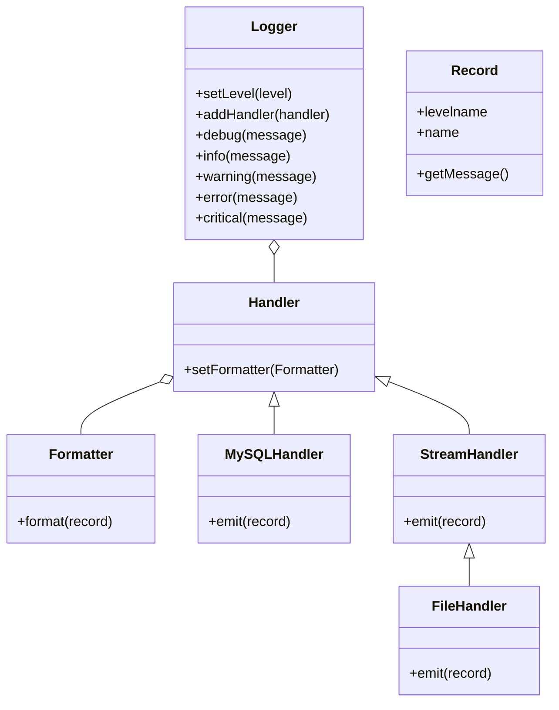

# Logging-Konzept

- den Ablauf des Programms nachvollziehbar machen
- Fehler und Exceptions dokumentieren
- wichtige Verarbeitungsschritte protokollieren
- bei der Fehlersuche unterstützen
- Informationen über die Anzahl verarbeiteter Datensätze liefern
- keine sensiblen Daten wie Passwörter oder Tokens speichern!!

# Log-Level

DEBUG
  ↓
INFO
  ↓
WARNING
  ↓
ERROR
  ↓
CRITICAL


| Level      | Verwendung                                                 | Beispiel                                    |
| ---------- | ---------------------------------------------------------- | ------------------------------------------- |
| `DEBUG`    | Detaillierte Informationen zur Entwicklung                 | SQL-Abfrage, einzelne Verarbeitungsschritte |
| `INFO`     | Normale Programminformationen                              | „1000 Datensätze eingelesen“                |
| `WARNING`  | Unerwartete Situation, Programm läuft weiter               | „5 Datensätze ohne Preis“                   |
| `ERROR`    | Fehler bei einer Verarbeitung                              | „CSV-Datei konnte nicht gelesen werden“     |
| `CRITICAL` | Schwerwiegender Fehler, Programm kann nicht weiterarbeiten | „Datenbankverbindung fehlgeschlagen“        |

# Logging Modul

Logging nach PEP282

https://peps.python.org/pep-0282/

# Installation

```pip install logging```  

----

# Klassenstruktur - UML

